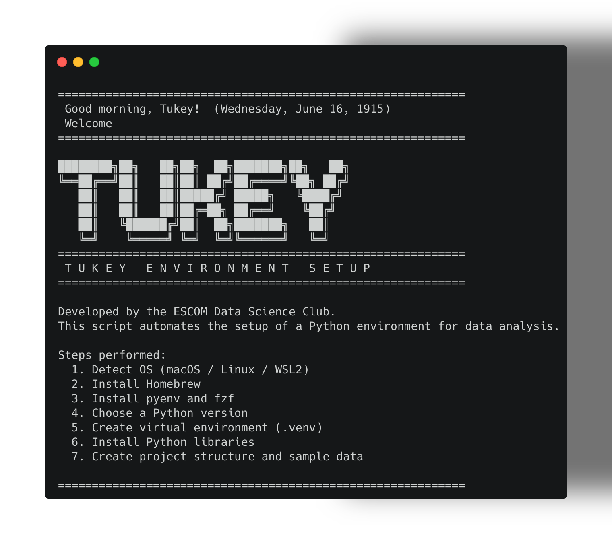

# 🦃 Tukey Start
> Configura tu entorno de Datos en segundos

**Tukey** es una herramienta de línea de comandos diseñada para desplegar un entorno completo de **Ciencia de datos** en Linux, macOS o WSL, aprovechando la velocidad de `uv`.

---



---

## Instalación rápida

Copia y pega este comando en tu terminal:

```bash
curl -fsSL https://raw.githubusercontent.com/Tukey-mx/TukeyStart/main/install.sh | bash
```

**Nota**: Si al finalizar el instalador te indica que el directorio no está en tu PATH, asegúrate de seguir las instrucciones en pantalla para agregarlo a tu .bashrc o .zshrc.

---

## Cómo usarlo

Desde cualquier directorio en tu terminal, simplemente ejecuta:

```bash
tukey
```

El script iniciará un asistente interactivo con los siguientes pasos:

1. Ubicación del proyecto: Te mostrará la ruta actual. Puedes presionar Enter para usar esa o escribir una nueva ruta.

2. Selección de Python: Verás una lista de versiones disponibles (usando fzf). Elige la que prefieras o escribe una manualmente.

3. Librerías: Se desplegará un menú para seleccionar paquetes base (Pandas, Numpy, Scikit-learn, etc.). Usa TAB para marcar los que quieras y Enter para confirmar.

4. Paquetes extra: Si necesitas algo específico (ej. tensorflow o torch), escríbelo al final.

---

## Características

* **Instalación rápida:** Listo en un comando.
* **Velocidad con `uv`:** Gestión de Python y paquetes hasta 100x más rápido.
* **Interfaz amigable:** Selección visual de versiones y librerías con `fzf`.
* **Entornos limpios:** Configura un `.venv` aislado para cada proyecto.
* **Notebook de inicio:** Incluye un `starter.ipynb` listo para correr.

---

## Requisitos

* **Sistemas:** Linux, macOS o WSL 2.
* **Internet:** Necesario para descargar herramientas y librerías.
* **Básico:** Tener `curl` instalado para ejecutar el instalador.

---

## Actualización

Para obtener la última versión, solo vuelve a ejecutar el instalador:

```bash
curl -fsSL https://raw.githubusercontent.com/Tukey-mx/TukeyStart/main/install.sh | bash
```
